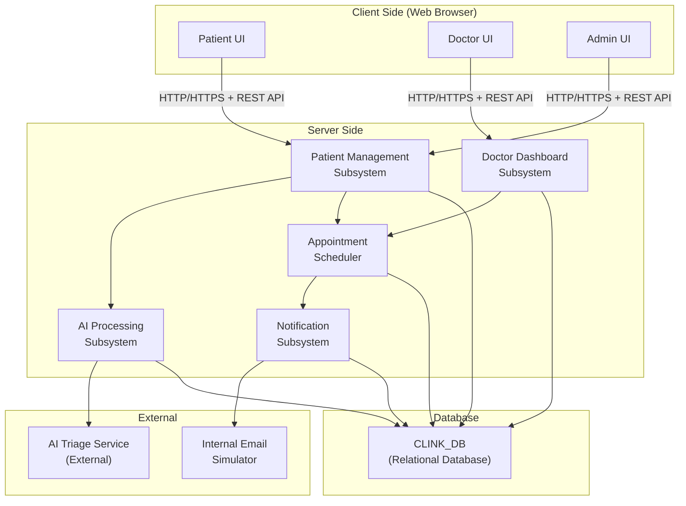
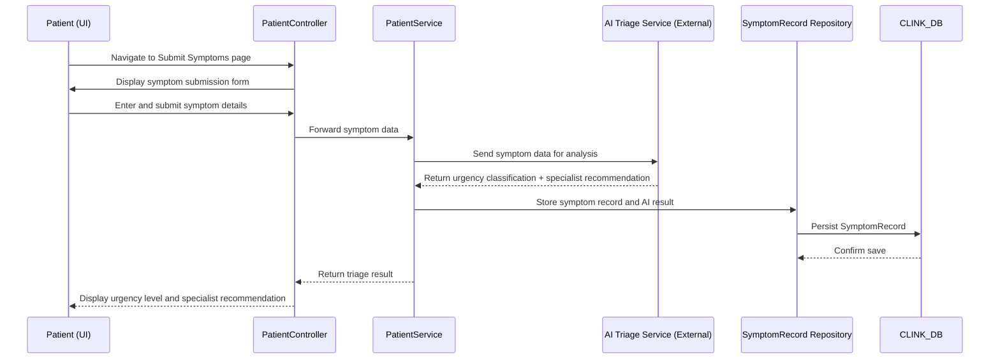
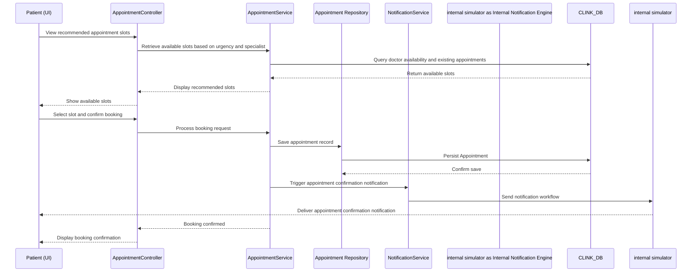

# TDD_FINAL.md

| Field | Value |
|---|---|
| **Document Name** | Technical Design Document – CLINK Smart Outpatient Triage and Scheduling System |
| **Version** | 1.0 |
| **Date** | January 2026 (SDS revision 01/01/2026) |
| **Status** | Initial Draft |
| **Source Reference** | CLINK – Smart Outpatient Triage and Scheduling System (FYP Report, UTM, January 2026); Appendix B: SRS v1.0; Appendix C: Software Design Specification (SDS) v1.0 |
| **Brief Explanation** | This TDD is derived exclusively from the CLINK FYP thesis and its embedded SDS appendix. It documents architecture, component model, technology stack, data design, interface design, runtime interaction flows, integration details, deployment context, and constraints exactly as documented in the source. |

---

# 1. Architecture (As Described)

## 1.1 Architectural Style

CLINK follows a **client–server architectural style** combined with **Clean Architecture** and the **Command and Query Responsibility Segregation (CQRS)** pattern. This combination supports scalability, maintainability, and separation of concerns through segregation.

The system is separated into two primary parts:
- **Client (Front-end)**: Provides the user interfaces and handles API integration, allowing patients, doctors, and administrators to engage the system via a web browser. All user requests (e.g., submitting symptoms, requesting an appointment) are transmitted to the server as HTTP requests, with the server returning responses asynchronously to create a responsive and smooth user experience.
- **Server (Back-end)**: Hosts the core application components partitioned into high-level subsystems based on functionality.

## 1.2 Layer Responsibilities (As Documented)

| Layer | Responsibility |
|---|---|
| **Presentation Layer** | Serves as a point of client request via Web API controllers. Receives HTTP/HTTPS requests from client interfaces. |
| **Application Layer** | Contains the main business logic, structured into commands, queries, services, and interfaces in line with the CQRS pattern. |
| **Domain Layer** | Separates the main domain objects and business regulations of outpatient triage and scheduling, ensuring consistency and alignment with healthcare necessities. |
| **Infrastructure Layer** | Handles data persistence and external services such as repositories and database context, allowing secure and efficient communication with the underlying database. |

---

# 2. System Component Model

## 2.1 Component Breakdown (As Documented)

| Subsystem | Responsibility |
|---|---|
| Patient Management Subsystem | Handles patient registration and case submission |
| AI Processing Subsystem | Classifies cases by urgency; recommends specialists |
| Doctor Dashboard Subsystem | Displays patient cases; allows doctors to update case status |
| Notification Subsystem | Sends updates to patients and doctors via internal simulated email workflows |
| Database Subsystem | Stores all persistent data (CLINK_DB) |

The client side consists of web-based user interfaces for patients, doctors, and administrators, which handle user interaction and input collection. The server side hosts the core application components. All persistent data is stored in a centralised relational database (CLINK_DB), accessed exclusively through server-side components. These components collaborate through well-defined interfaces and API communication to support end-to-end outpatient triage, prioritisation, scheduling, and notification workflows.

**Package Organisation (from SDS Package Diagram):**

| Package | Contents |
|---|---|
| `ui` | All user interface components |
| `controller` | Manages request handling and coordination between UI and business logic |
| `service` | Core system functionality including AI-assisted triage and appointment scheduling |
| `model` | Domain entities |
| `repository` | Data persistence management |
| `database` | Database access layer |
| `notification` | Integration with external notification workflow system (Internal Notification Engine) |

**Controller Classes (from Logical Viewpoint):**

| Controller | Responsibility |
|---|---|
| AdminController | Handles administrative operations |
| PatientController | Manages patient interactions and requests |
| DoctorController | Supports doctor dashboard functionality |
| AppointmentController | Controls appointment scheduling and updates |

## 2.2 Component Diagram (Derived from Documented Structure)

---

# 3. Technology Stack (Exact as Documented)

## 3.1 Core Technologies

| Component | Technology | Description |
|---|---|---|
| Backend Language | Python | Primary high-level programming language used as a backend for AI-based symptom analysis, urgency classifier, server-side code, and data processing. |
| Front-end | HTML, CSS, JavaScript | Creation of web-based user interface, organisation of application pages, development of responsive designs, and interactive features. |
| AI Classification | Python with scikit-learn (Decision Tree), pandas, NumPy. The AI Triage Subsystem dynamically parses dataset.csv, symptom_Description.csv, symptom_precaution.csv, and Symptom-severity.csv to construct one-hot encoded decision trees and extract medical context (descriptions, precautions, and dynamic severity weights >= 6 for urgency). | Analyses patient symptoms to classify cases as urgent or non-urgent; provides specialist recommendations. Trained using publicly available healthcare dataset. |
| Workflow Automation | Internal Notification System | Automates workflows to notify about appointments, urgency notifications, and schedule updates. |
| Version Control | GitHub | Code management, secure storage of project repository, version control. |
| IDE | Visual Studio Code | Write, debug, and maintain backend and frontend code (Python, HTML, CSS, JavaScript). |
| UI Design Tool | Figma | User interface prototype design for patient and doctor dashboards. |
| Architecture Pattern | Client–Server + Clean Architecture + CQRS | Scalability, maintainability, separation of concerns. |
| Data Management | CRUD (Create, Read, Update, Delete) | Managing patient records, appointments, and doctor schedules. |
| Network | Local server (localhost) + internal Python service calls | Secure communication environment and automated workflow execution. |

## 3.2 External Software Interfaces and Versions (Exact — from SDS)

| Name | Mnemonic | Version | Source |
|---|---|---|---|
| Web Browser | N/A | Latest | Chrome, Firefox, Edge |
| Relational Database System | RDBMS | MySQL / PostgreSQL | Open-source |

| Operating System | OS | Platform-independent | Windows / Linux |

---

# 4. System Requirements (Software/Hardware) — Exact as Documented

## 4.1 Software Requirements (Exact — Table 3.2)

| Software Type | Software Name | Description |
|---|---|---|
| IDE | Visual Studio Code | Write, debug, and maintain backend and frontend code such as Python and HTML and CSS and JavaScript. |
| Programming Language | Python | The primary high-level programming language to be used as a backend in AI-based symptom analysis, urgency classifier, server-side code, and data processing. |
| Web Technologies | HTML, CSS, JavaScript | Utilised in the creation of the web-based user interface, organisation of application pages, development of responsive designs, and interactive features. |
| Version Control | GitHub | Code management, secure storage of project repository version control. |
| Workflow Automation | Internal Notification Engine | Used to automate workflows to notify about appointments, urgency notifications, and updates on schedules. |
| UI Design Tool | Figma | Experience in creating user interface prototypes on patient and doctor dashboard implemented. |

## 4.2 Hardware Requirements (Exact — Table 3.3)

| Hardware | Specification | Justification |
|---|---|---|
| Laptop / PC | Standard laptop | Applications used in system development, testing, AI processing, frontend design, backend development, and workflow automation. |

*Additional hardware constraint from SRS: The system will require a minimum 8GB of RAM in computers and normal web browsers.*

---

# 5. Data Design

## 5.1 Persistent Entities

The major data entities are stored in a database named **CLINK_DB**, which comprises six main entities:

1. Admin
2. Patient
3. Doctor
4. SymptomRecord
5. Appointment
6. Notification

## 5.2 Entity Purposes (Exact — from SDS Information Viewpoint)

| Entity Name | Description |
|---|---|
| Admin | Stores administrative user details and system roles |
| Patient | Stores patient personal and login information |
| Doctor | Stores doctor details, specialisation, and availability |
| SymptomRecord | Stores patient-submitted symptoms and urgency classification |
| Appointment | Stores outpatient appointment details and status |
| Notification | Stores system notifications sent to users |

## 5.3 Data Dictionary (Exact — from SDS Data Dictionary)

### Entity: Admin

| Attribute Name | Type | Description |
|---|---|---|
| adminID | int | Unique identifier for the admin |
| name | string | Administrator name |
| role | string | Role or permission level |

### Entity: Patient

| Attribute Name | Type | Description |
|---|---|---|
| patientID | int | Unique identifier for the patient |
| name | string | Patient full name |
| email | string | Patient email address |
| phone | string | Patient contact number |
| password | string | Encrypted patient password |

### Entity: Doctor

| Attribute Name | Type | Description |
|---|---|---|
| doctorID | int | Unique identifier for the doctor |
| name | string | Doctor full name |
| specialization | string | Medical specialisation |
| availability | string | Doctor availability status |

### Entity: SymptomRecord

| Attribute Name | Type | Description |
|---|---|---|
| recordID | int | Unique identifier for the symptom record |
| symptomDetails | text | Patient symptom description |
| urgencyLevel | string | Classified urgency level |
| createdAt | datetime | Record creation timestamp |

### Entity: Appointment

| Attribute Name | Type | Description |
|---|---|---|
| appointmentID | int | Unique identifier for the appointment |
| date | date | Appointment date |
| time | time | Appointment time |
| status | string | Appointment status |

### Entity: Notification

| Attribute Name | Type | Description |
|---|---|---|
| notificationID | int | Unique identifier for the notification |
| message | string | Notification message content |
| timestamp | datetime | Time the notification was generated |
| isRead | boolean | Read status of the notification |

### Algorithm Viewpoint — Extended Attribute Categories (Exact — from SDS Section 5.9.2)

| Entity | Attribute Category | Attribute Name | Description |
|---|---|---|---|
| Patient | Identification | patientID | Unique identifier assigned to each patient |
| Patient | Data | name | Full name of the patient |
| Patient | Data | contactInfo | Patient contact details (email or phone number) |
| Patient | Processing | accountStatus | Indicates whether the patient account is active or inactive |
| Doctor | Identification | doctorID | Unique identifier assigned to each doctor |
| Doctor | Data | specialization | Medical specialisation of the doctor |
| Doctor | Data | availability | Available consultation time slots |
| Doctor | Processing | casePriority | Priority level of assigned patient cases |
| Admin | Identification | adminID | Unique identifier assigned to the administrator |
| Admin | Data | role | Administrative role and permissions |
| Admin | Processing | accessLevel | Defines scope of administrative control |
| SymptomRecord | Identification | recordID | Unique identifier for each symptom record |
| SymptomRecord | Data | symptomDetails | Description of patient symptoms |
| SymptomRecord | Processing | urgencyLevel | Urgency classification generated by AI triage |
| SymptomRecord | Processing | analysisStatus | Indicates whether symptom analysis is pending or completed |
| Appointment | Identification | appointmentID | Unique identifier for each appointment |
| Appointment | Data | date | Scheduled appointment date |
| Appointment | Data | time | Scheduled appointment time |
| Appointment | Processing | status | Current appointment state (Requested, Scheduled, Completed, Cancelled) |
| Notification | Identification | notificationID | Unique identifier for each notification |
| Notification | Data | message | Notification message content |
| Notification | Data | timestamp | Date and time notification was generated |
| Notification | Processing | deliveryStatus | Indicates whether the notification is sent or pending |

### Domain Model Relationships (from SRS Section 2.2.5)

- A Patient can have one or more Appointments.
- A Doctor can be assigned to multiple Appointments.
- Each Symptom Record is associated with a Patient and linked to AI triage results.
- Notifications are generated for Patients and Doctors based on appointment or case status updates.
- A Patient can submit multiple SymptomRecords.
- A Doctor reviews assigned SymptomRecords.
- A SymptomRecord may generate an Appointment.
- Admin manages Patients and Doctors.

---

# 6. Interface Design

## 6.1 User Interfaces

All interfaces are accessed through a standard web browser and follow a consistent layout and navigation structure.

### Patient Interface

- Allow patient registration and login.
- Provides symptom submission forms with guided input fields.
- Displays AI-generated urgency level and appointment status.
- Allows appointment booking and viewing of notifications.
- Uses form-based input, dropdown menus, and confirmation messages.

**Patient Interface Screens (from SDS Section 6.2.1):**
1. Patient Registration Screen
2. Patient Login Screen
3. Submit Symptoms Screen
4. View Triage Result Screen
5. Book Appointment Screen
6. Patient Notifications Screen

### Doctor Interface

- Dashboard displaying prioritised patient cases.
- View symptom records and AI urgency classification.
- Update appointment decisions and consultation status.
- Displays notifications for new or updated cases.

**Doctor Interface Screens (from SDS Section 6.2.2):**
1. Doctor Login Screen / Doctor Dashboard (Prioritised Cases)
2. View Patient Case Details
3. Update Case Status Screen

### Admin Interface

- User management (add, update, deactivate users).
- Manage doctor schedules and system configurations.
- View system summaries and logs.

**Admin Interface Screens (from SDS Section 6.2.3):**
1. Admin Login Screen
2. Manage Users Screen
3. Configure Schedules Screen

### Interface Optimization

- Minimal data entry using dropdowns and predefined options.
- Clear error messages with actionable guidance.
- Confirmation messages for critical actions (e.g., appointment booking).
- Consistent button placement and labeling across pages.
- Simple and readable layouts suitable for non-technical users.
- A first-time patient user can successfully submit symptoms and book an appointment within 5 minutes after a short system introduction.

### All Interfaces Use

- Standard web page layouts.
- Clear menu navigation.
- Role-based access control.
- Consistent feedback messages (success, warning, error).

## 6.2 Communication Interfaces

- HTTP / HTTPS for communication between client interfaces and the application server.
- RESTful APIs for request and response exchange.
- JSON format for message content.
- Secure communication using authentication and authorisation mechanisms.

### Hardware Interfaces

CLINK does not require specialised hardware. The system interfaces with standard user devices through a web browser.

Supported hardware includes:
- Desktop and laptop computers.
- Tablets and smartphones.
- Standard input devices (keyboard, mouse, touch screen).

The system requires:
- Internet connectivity.
- A device capable of running a modern web browser.

No direct interaction with hardware components such as sensors or medical devices is supported in this version of the system.

---

# 7. Runtime Interaction & Data Flow

## 7.1 Submit Symptoms and AI Triage Analysis (SD001/SD002 — from SDS Section 5.7.2)

## 7.2 Book Appointment (SD003 — from SDS Section 5.7.2)

---

# 8. Integration Details

## 8.1 AI Triage Service (External Actor)

- Receives patient symptom data from the CLINK system server.
- Analyses symptom details to classify cases as urgent or non-urgent.
- Provides specialist type recommendations based on analysed symptoms.
- Returns classification result to the CLINK system for display to the patient and storage in SymptomRecord.
- Python with scikit-learn (Decision Tree), pandas, and NumPy are used for data processing and model implementation.
- Model is trained using a publicly available healthcare dataset related to patient symptoms and clinical conditions.

## 8.2 Internal Notification Engine Automation

- Used to automate workflows to notify about appointments, urgency notifications, and updates on schedules.
- Automates administrative processes and minimises manual follow-up processes, enhancing system effectiveness.
- Receives notification triggers from the CLINK Notification Subsystem.
- Delivers automated notifications to patients and doctors regarding appointment status changes and case updates.
- Integrated through API links between the backend and Internal Notification Engine (local server communication).
- Deployed on local server (localhost) as part of the demonstration and testing environment.

---

# 9. Deployment & Operations Context

## 9.1 Hosting Environment

- The system is deployed on a local server (localhost) as a demonstration and testing system.
- A standard laptop is sufficient for system development and testing, providing adequate computing resources for the AI model, front-end development, and workflow automation.

## 9.2 Operational Dependencies

| Phase | Tools Used | Purpose |
|---|---|---|
| Planning | Agile Backlog, Sprint Plan | Organise activities, rank needs, schedule milestones, and track project completion with a Gantt chart. |
| Development | Visual Studio Code, GitHub | Provide system features, maintain source code, change tracking, and facilitate collaborative development. |
| Testing | Manual Testing, Functional Testing, Integration Testing | Check system functionality, AI outputs, module integration, and end-of-sprint user requirements. |
| Deployment | Local Server (localhost), Internal Notification Engine | Install system for demonstration; allow automatic notification and schedule adjustments. |

## 9.3 Operations Phase Notes

- internal simulated email workflows implemented to allow automated notifications and schedule updates.
- The system is designed to be accessible 24 hours a day, except during scheduled maintenance (NFR-020).
- System maintenance activities shall not exceed 24 hours per maintenance period (NFR-021).
- Future improvement suggestions include: EMR integration, patient flow prediction analytics, and mobile application support.

---

# 10. Constraints

## 10.1 Scope Constraints ("The System Will Not")

- Provide medical diagnosis beyond urgency classification.
- Replace clinical decision-making by licensed healthcare professionals.
- Integrate with full Electronic Medical Record (EMR) systems at this stage.
- Support inpatient admissions or emergency care workflows.
- Integrate directly with medical devices.

## 10.2 Design Constraints (Numbered List)

1. The system should be reliable in common hospital IT conditions (Environmental Constraint).
2. The system will require a minimum 8GB of RAM in computers and normal web browsers (Hardware Constraint).
3. Any sensitive information should be encrypted (Security Constraint).
4. Role-based access control has to be implemented (Security Constraint).
5. The system should be able to run with Windows 10 and more recent browsers (Compatibility Constraint).
6. The system shall not display any content that is offensive to any race, religion, or culture (NFR-012).
7. The development duration of the system shall not exceed the allocated project timeline (NFR-014).
8. The system is implemented as a web-based client–server application (Design Assumption).
9. AI-based triage supports decision-making but does not replace medical professionals (Design Assumption).
10. A single relational database is used for persistent data storage (Design Assumption).
11. External notification handling is performed through an automation workflow (Design Assumption).

## 10.3 Performance/Capacity Constraints

| Constraint | Requirement |
|---|---|
| Simultaneous Users | Minimum 1000 simultaneous users |
| Response Time | Less than 5 seconds |
| Authentication | System shall authenticate users within 10 seconds (NFR-001) |
| Database Retrieval | System shall retrieve data from database within 10 seconds (NFR-008) |
| Database Update | System shall update existing records within 10 seconds (NFR-009) |
| Database Insert | System shall insert new records within 10 seconds (NFR-010) |
| AI Triage Response | System shall process AI-based triage results within an acceptable response time (NFR-006) |
| User Interactions | System functionalities shall be accessible within five user interactions (clicks) (NFR-016) |
| System Reliability | System shall perform core functionalities with at least 99% reliability (NFR-022) |
| Availability | System shall be available 24 hours a day, except during scheduled maintenance (NFR-020) |
| Maintenance Duration | System maintenance activities shall not exceed 24 hours per maintenance period (NFR-021) |
